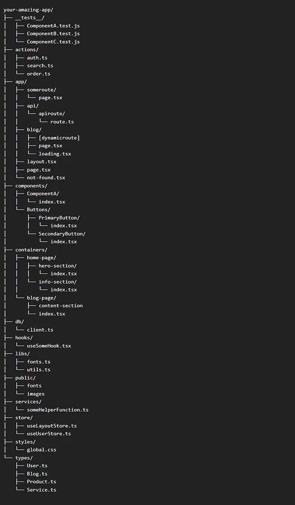

This is a [Next.js](https://nextjs.org/) project bootstrapped with [`create-next-app`](https://github.com/vercel/next.js/tree/canary/packages/create-next-app).

## Getting Started

First, run the development server:

```bash
npm run dev
# or
yarn dev
# or
pnpm dev
# or
bun dev
```

Open [http://localhost:3000](http://localhost:3000) with your browser to see the result.

You can start editing the page by modifying `app/index.tsx`. The page auto-updates as you edit the file.

This project uses [`next/font`](https://nextjs.org/docs/basic-features/font-optimization) to automatically optimize and load Inter, a custom Google Font.

## Learn More

To learn more about Next.js, take a look at the following resources:

- [Next.js Documentation](https://nextjs.org/docs) - learn about Next.js features and API.
- [Learn Next.js](https://nextjs.org/learn) - an interactive Next.js tutorial.

You can check out [the Next.js GitHub repository](https://github.com/vercel/next.js/) - your feedback and contributions are welcome!

## Deploy on Vercel

The easiest way to deploy your Next.js app is to use the [Vercel Platform](https://vercel.com/new?utm_medium=default-template&filter=next.js&utm_source=create-next-app&utm_campaign=create-next-app-readme) from the creators of Next.js.

Check out our [Next.js deployment documentation](https://nextjs.org/docs/deployment) for more details.



Ways to improve this project:

## Features

- Code Consistency and Formatting
    - Ensure consistent code formatting using tools like Prettier.
    - Use consistent naming conventions for variables, functions, and components.

- Component Structure
    - Organize components into folders based on their functionality.
    - Separate concerns by creating smaller, reusable components.

- CSS and Styling
    - Use a consistent styling approach (e.g., CSS Modules, Styled Components, Tailwind CSS).
    - Ensure responsive design for different screen sizes.

- TypeScript
    - Ensure all components and functions are typed correctly.
    - Use interfaces and types to define props and state.

- Error Handling
    - Implement proper error handling in your components and API calls.
    - Use try-catch blocks and display user-friendly error messages.

- Accessibility
    - Ensure your application is accessible by following WCAG guidelines.
    - Use semantic HTML elements and ARIA attributes where necessary.

- Performance Optimization
    - Optimize images and other assets.
    - Use lazy loading for components and images.
    - Minimize and bundle your JavaScript and CSS files.

- Testing
    - Write unit tests for your components using a testing library like Jest.
    - Implement end-to-end tests using tools like Cypress.

- Documentation
    - Add comments and documentation to your code.
    - Create a README file with clear instructions on how to set up and run the project.

- Version Control
    - Use meaningful commit messages.
    - Organize your Git branches and use pull requests for code reviews.

- CI/CD
    - Set up continuous integration and continuous deployment pipelines using tools like GitHub Actions.

- Security
    - Ensure your application is secure by following best practices (e.g., sanitizing inputs, using HTTPS).

## Installation
Provide steps on how to install and set up the project.

## Usage
Explain how to use the project and any important information related to its functionality.

## Contributing
State if you are open to contributions and provide guidelines for how to contribute to the project.

## License
Specify the license under which the project is distributed.

## Acknowledgements
Give credits or acknowledgement to any external resources, libraries, or individuals that have contributed to the project.
